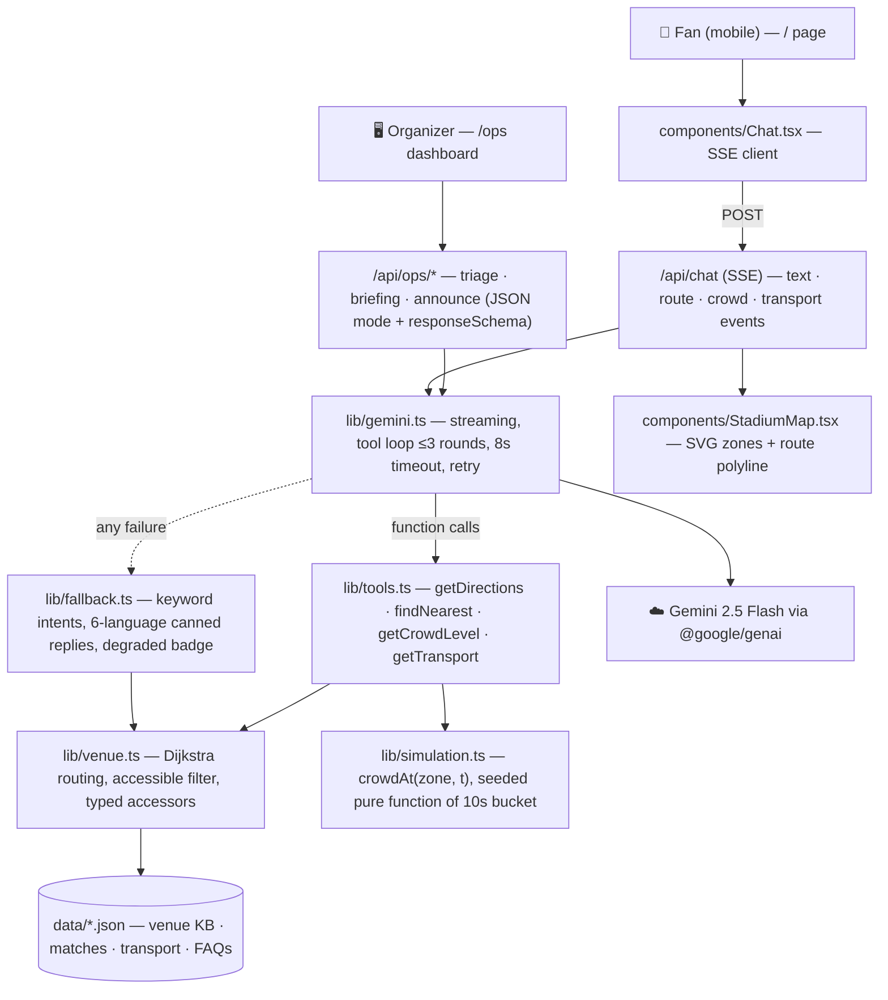

# ⚽ MatchDay Copilot


**A multilingual stadium copilot for FIFA World Cup 2026 fans — ask anything, in any language, and get grounded directions drawn live on the stadium map.**

Built for **Hack2skill × Google for Developers — PromptWars**, Challenge 4: *Smart Stadiums & Tournament Operations*.

🔗 **Live demo:** `<DEPLOYED_URL_PLACEHOLDER>` · **Ops dashboard:** `<DEPLOYED_URL_PLACEHOLDER>/ops`

---

## The problem

The 2026 World Cup packs 58,000+ fans into stadiums where most visitors **don't speak the local language and have never been in the building**. Finding your seat, halal food, a prayer room, a step-free route, or the least-crowded exit after the final whistle are real, stressful journeys — and static signage solves none of them.

**Persona:** a visiting fan who doesn't speak the local language and can't find their way around.

## The solution

A mobile-first copilot that answers in **the fan's own language** (tested in English, Spanish, French, Arabic, Portuguese and Hindi — any language Gemini speaks works), where every answer is **grounded**:

- 🗺️ **Real navigation, not chat theatre** — Gemini calls `getDirections`/`findNearest`; a Dijkstra router over a hand-authored waypoint graph computes the path; the app draws it on an SVG stadium map with numbered steps.
- ♿ **Accessibility as a first-class journey** — one toggle switches to large text, a simple-language prompt variant, and step-free routing (same algorithm, stairs-free edge set → lifts and ramps).
- 📊 **Crowd-aware advice** — a deterministic, seeded crowd simulation drives "Gate B is congested, use Gate D" advisories, map heat-shading, and post-match transport strategy.
- 🚇 **Getting home** — metro/bus/parking options with surge notes and a departure-timing suggestion.
- 🎛️ **Ops dashboard (stretch)** — live heatmap, simulated incident feed with **JSON-mode triage**, one-click shift briefings, and PA announcements translated into 6 languages.
- ⚡ **A demo that cannot hard-fail** — with no API key, on quota exhaustion, or on any Gemini error, a keyword-intent resolver answers the core journeys with canned multilingual text and the **same real routing engine**. The UI shows a subtle "demo mode" badge; navigation never breaks.

## Architecture



**Key design decisions** (evolution documented in [`docs/PROMPT_JOURNAL.md`](docs/PROMPT_JOURNAL.md)):

- **Serverless-safe simulation** — `crowdAt(zoneId, t)` is a pure function of a 10-second time bucket (mulberry32-seeded). Every Vercel instance, the fan map, the ops heatmap, and the model's `getCrowdLevel` tool all agree without any shared state.
- **Map and router can't disagree** — the SVG shapes and the route polyline are generated from the *same* graph coordinates.
- **Raw SSE over an AI SDK** — the event protocol (`text | route | crowd | transport | degraded | done`) carries structured map payloads and makes the fallback path indistinguishable from the AI path.

## Gemini features used

| Capability | Where | Why it matters |
| ---------- | ----- | -------------- |
| Streaming chat | `/api/chat` → `lib/gemini.ts` | Fast first token; instant perceived response |
| Function calling (4 tools) | `getDirections`, `findNearest`, `getCrowdLevel`, `getTransport` | The **only** source of navigational facts — hallucinated directions are structurally impossible |
| JSON mode + `responseSchema` | `/api/ops/triage`, `/briefing`, `/announce` | Machine-actionable ops outputs with enum-constrained severity/roles |
| Multilingual reasoning | System prompt language directive | Auto-detects and answers in the fan's language, incl. RTL Arabic |
| Prompt engineering | `lib/prompts.ts` (all prompts in one documented module) | Grounding rules, KB digest < 1.5k tokens, few-shot tool nudge, simple-language a11y variant |

### Prompt-engineering highlights

From `lib/prompts.ts` (the whole file is the documentation):

> ```
> GROUNDING RULES — never break these:
> 1. Directions, walking routes, crowd levels and transport facts MUST come from
>    your tools… NEVER invent a route, gate, distance, or crowd state from memory.
> 2. …If something is not in [the venue knowledge], say you don't know and suggest
>    the Information Desk on the North Concourse (near Gate A).
> ```

The single few-shot exchange is deliberately **in Spanish** — it teaches tool-use and reply-in-user's-language in one example. The full prompt evolution (first attempts → refinements → why) is in [`docs/PROMPT_JOURNAL.md`](docs/PROMPT_JOURNAL.md).

## Screenshots

| Fan chat + live route | Wheelchair routing | Ops heatmap + triage |
| --- | --- | --- |
| *(screenshot placeholder)* | *(screenshot placeholder)* | *(screenshot placeholder)* |

## Honest disclosure: simulated data

Estadio Aurora is a **fictional venue**: the layout, POIs, routing graph, match schedule, transport table, crowd levels and incident feed are hand-authored/simulated (deterministically, so judges see reproducible behavior). The GenAI experience — grounding, tool calling, multilingual reasoning, JSON mode — is fully real.

## Local setup

```bash
git clone <REPO_URL_PLACEHOLDER>
cd matchday-copilot
npm install
cp .env.example .env.local   # add your GEMINI_API_KEY (or leave empty for demo mode)
npm run dev                  # http://localhost:3000
```

```bash
npm test                     # 23 unit tests (routing, simulation, fallback)
npm run build                # production build
node scripts/qa-matrix.mjs   # 35-probe multilingual QA matrix (needs a running server)
```

### Environment variables

| Variable | Required | Notes |
| -------- | -------- | ----- |
| `GEMINI_API_KEY` | No — app degrades gracefully | Server-side only; never sent to the client. Get one at [Google AI Studio](https://aistudio.google.com/apikey) |

## Deploy (Vercel)

1. Push this repo to GitHub (public).
2. [vercel.com/new](https://vercel.com/new) → Import the repo → defaults are correct (Next.js preset) → **Deploy**.
3. Project → **Settings → Environment Variables** → add `GEMINI_API_KEY` (Production) → **Redeploy**.
4. Verify both demo modes: open the URL (AI mode), then temporarily remove the env var + redeploy to confirm degraded mode still navigates. Re-add the key.

## Tech stack

Next.js 15 (App Router) · TypeScript · Tailwind CSS 4 · `@google/genai` (Gemini 2.5 Flash) · Vitest · Vercel

## Repo guide

```
app/            pages + API routes (chat SSE, crowd, transport, ops/*)
components/     Chat, StadiumMap, CrowdBanner, TransportCard, AccessibilityToggle
lib/            prompts.ts (all prompt craft) · gemini.ts (gateway) · tools.ts
                venue.ts (routing) · simulation.ts (crowd) · fallback.ts (degraded mode)
data/           venue.json (zones/POIs/graph) · matches · transport · faqs
tests/          vitest suites · scripts/qa-matrix.mjs (35 multilingual probes)
docs/           ARCHITECTURE.md · DEMO_SCRIPT.md · PROMPT_JOURNAL.md · LINKEDIN_POST.md
```
